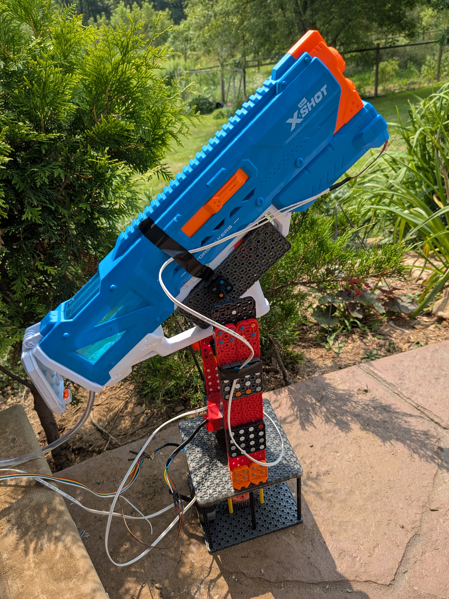

# Bird Bouncer
 This handy machine makes it so chickens do not make your nice cement pad turn into the poop deck. The innovative machine tracks chickens, and detects if they go on your precious cement pad, and if they do, the 'Bird Bouncer' will soak them, making them regret their decision to ever go on the cement pad. 

## How The Bird Bouncer works:

Add an explanation of the algorithm and how it works. Make sure to include details about how the code works, what it depends on, and any other relevant info. Add images or other descriptions for your project here. 

## Running this project

1. Install python 3.9, on the jetson nano you have to compile it yourself
2. install the following libraries :
flask
cv2
roboflow
supervision
3. Run the provided python code (make sure to put your own roboflow API key in the respetive variable)

<video src="./Images/annotated_output1.mp4" controls width="600">
  Your browser does not support the video tag.
</video>
